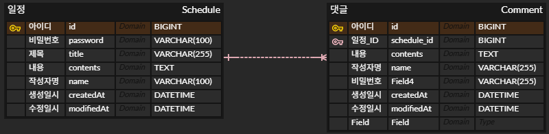

# 📅 일정 관리 앱 만들기

## 1. API 명세

---

### (1) 일정 생성

| Method | Endpoint   | Description | Parameters | Status Code |
|--------|------------|-------------|------------|-------------|
| POST   | /schedules | 일정 생성       | 없음         | 201 CREATED |

- **Request Body**:
  ```
  {
    "title": "string",
    "contents": "string",
    "name": "string",
    "password": "string"
  }
  ```

- **Response**:
  ```
  {
    "id": long,
    "title": "string",
    "contents": "string",
    "name": "string",
    "createdAt": "string",
    "modifiedAt": "string"
  }
  ```

---

### (2) 전체 일정 목록 조회

| Method | Endpoint     | Description | Parameters         | Status Code |
|:-------|:-------------|:------------|:-------------------|:------------|
| `GET`  | `/schedules` | 전체 일정 조회    | Query:<br/>- `name` | `200 OK`    |

- **Request Body**: 없음

- **Response**:
  ```
  [
    {
      "id": long,
      "title": "string",
      "contents": "string",
      "name": "string",
      "createdAt": "string",
      "modifiedAt": "string"
    }
  ]
  ```

---

#### (3) 선택 일정 조회

| Method | Endpoint          | Description | Parameters        | Status Code |
|:-------|:------------------|:------------|:------------------|:------------|
| `GET`  | `/schedules/{id}` | 선택 일정 조회    | Path: <br/>- `id` | `200 OK`    |

- **Request Body**: 없음
- **Response**:
  ```
  {
    "id": long,
    "title": "string",
    "contents": "string",
    "name": "string",
    "createdAt": "string",
    "modifiedAt": "string"
    "comments": "string"
  }
  ```

---

### (4) 선택한 일정 수정

| Method | Endpoint          | Description | Parameters       | Status Code |
|:-------|:------------------|:------------|:-----------------|:------------|
| `PUT`  | `/schedules/{id}` | 선택 일정 수정    | Path:<br/>- `id` | `200 OK`    |

- **Request Body**:
  ```
  {
    "title": "string",
    "name": "string",
    "password": "string"
  }
  ```
- **Response**:
  ```
  {
    "id": long,
    "title": "string",
    "contents": "string",
    "name": "string",
    "createdAt": "string",
    "modifiedAt": "string"
  }
  ```

---

### (5) 선택한 일정 삭제

| Method   | Endpoint          | Description | Parameters       | Status Code |
|:---------|:------------------|:------------|:-----------------|:------------|
| `DELETE` | `/schedules/{id}` | 선택한 일정 삭제   | Path:<br/>- `id` | `200 OK`    |

- **Request Body**:
  ```
  {
    "password": "string"
  }
  ```
- **Response**:
  ```
  {
    "message": "일정이 삭제되었습니다."
  }
  ```

---

---

### (6) 댓글 생성

| Method   | Endpoint          | Description | Parameters       | Status Code |
|:--- |:--- |:--- |:--- |:--- |
| `POST` | `/schedules/{id}/comments` | 댓글 생성   | Path:<br/>- `id` | `201 CREATED`    |

- **Request Body**:
  ```
  {
    "contents": "string",
    "name": "string",
    "password": "string"
  }
  ```
- **Response**:
  ```
  {
    "id": long,
    "contents": "string",
    "name": "string",
    "createdAt": "string",
    "modifiedAt": "string"
  }
  ```
  
---
<br>

## 2. ERD


#### Schedule (일정)
```sql
CREATE TABLE `Schedule` (
    `id`         BIGINT         NOT NULL AUTO_INCREMENT PRIMARY KEY,
    `password`   VARCHAR(255)   NOT NULL,
    `title`      VARCHAR(255)   NOT NULL,
    `contents`   TEXT           NOT NULL,
    `name`       VARCHAR(255)   NOT NULL,
    `createdAt`  DATETIME       NOT NULL,
    `modifiedAt` DATETIME       NOT NULL
);
```

#### Comment (댓글)
```sql
CREATE TABLE `Comment` (
    `id`          BIGINT         NOT NULL AUTO_INCREMENT PRIMARY KEY,
    `schedule_id` BIGINT         NOT NULL,
    `contents`    TEXT           NOT NULL,
    `name`        VARCHAR(255)   NOT NULL,
    `password`    VARCHAR(255)   NOT NULL,
    `createdAt`   DATETIME       NOT NULL,
    `modifiedAt`  DATETIME       NOT NULL,
    FOREIGN KEY (schedule_id) REFERENCES Schedule(id)
);